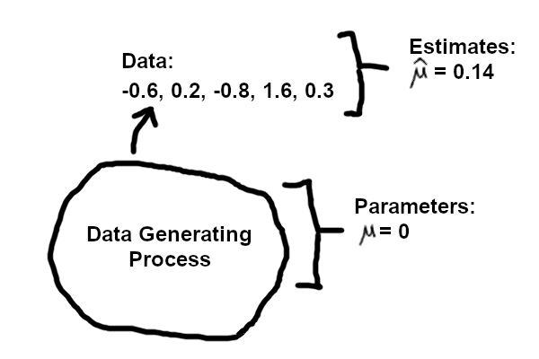

```{r}
#| label: initialize
#| echo: FALSE
knitr::opts_chunk$set(echo = TRUE, fig.width=7, fig.height=5) 
```

## Introduction

*Estimation* is a part of data analysis, where we attempt to summarize information about the world into a concise format. You can think of it as a form of *compression*, where we take a dataset, potentially large, and summarize it with a few numbers. For example, we may have a dataset of numbers: {`r set.seed(1); round(rnorm(5), 1)`}, and we may want to summarize these numbers with the average value and also the spread. 

We often write some data with $\{x_i\}$ using subscripts for the data points, e.g. $\{x_1, x_2, \dots, x_n\}$. The average of these values is $\bar{x} =$ `r set.seed(1); mean(round(rnorm(5), 1))`, where the bar denotes a sample mean. To be explicit that it involves _n_ numbers we could also write $\bar{x}_n$. If we define $\mu$ as the mean of the underlying data-generating distribution, then $\bar{x}$ is also an estimate of $\mu$, written $\hat{\mu}$: the hat indicates that we estimated something from data. The spread is typically represented by the variance, or its square root, the standard deviation (SD). The SD of these numbers is $s =$ `r set.seed(1); round(sd(round(rnorm(5), 1)), 4)`, and we could also say this is $\hat\sigma$, an estimate of the SD of the data-generating distribution.

As we hinted, we aren't solely interested in this particular set of numbers, but in the average or mean of the values if we were to keep collecting data without end. This number is $\mu$ (as well as the standard deviation $\sigma$). The set of data values we observe is a *random* set. It is representative of a *data generating process*. We aim to produce useful summaries of information about the data generating process, via the random dataset that we observe. We can compute $\bar{x}_n = \hat{\mu}$, but as all data is finite, we will never be able to compute or observe $\mu$ in an experiment with $n < \infty$. A simple diagram:

{width="400"}

In this document, we will explore how randomness and sample design inform statistical estimation, in particular what behavior can be expected from estimators for things like the mean, with experiments of a given sample size _n_. 

We will use random simulation to explore propoerties of estimators. E.g. with simulations we can:

- generate samples from the Normal distribution, where we know the parameters exactly
- estimate the mean of the distribution from samples of different size
- examine the spread of these estimates, how close are they to the true value

We can also take a dataset and pretend it is the entire population, and then simulate smaller datasets by drawing from this dataset. We can draw with replacement (e.g. some original samples may be drawn more than once), in order to simulate datasets of size similar to the original dataset. (You may know that doing this with sample size equal to the original dataset is called "bootstrapping".)  

In the above list of simulation tasks, you can think of "distribution" = data generating process.

While experiments and data help us to understand biological phenomena, simulations help to understand statistical concepts -- one can directly observe and quantify the behavior of estimators under controlled conditions where the true underlying parameters are known. And they help us consider how estimates are random and have distributions as they are functions of data.

I use the word "estimate" to refer to a particular computed value from data. An "estimator" is a formula, e.g. $\bar{x}_n = \frac{1}{n} \sum_{i=1}^{n} x_i$, the mean of the sample with sample size _n_. Another estimator is the median (the middle value, when the data is ranked in order). The mean and the median are both estimators for $\mu$, the thing which we want to estimate, but they have different properties, both when the data is Normal, and for when the data may have a skew to the right (many high values) or to the left (many low values).

## Build a penguin sampler

The [palmerpenguins](https://allisonhorst.github.io/palmerpenguins/) package provides data for 344 penguins across three species collected at Palmer Station, Antarctica. Details and credit can be found at that link. We focus here on the body mass of Gentoo penguins as a stand-in for a real biological population:

```{r}
suppressPackageStartupMessages({

  library(palmerpenguins)

})

head(penguins)

gentoo_mass <- penguins$body_mass_g[
  penguins$species == "Gentoo" & !is.na(penguins$body_mass_g)
]

cat("\nnumber of Gentoo body mass measurements:\n")
length(gentoo_mass)
```

Use the slider to choose a sample size `n`. Each time the slider moves, a new random sample of `n` penguins is drawn from the Gentoo population and the sample mean is computed. The red line marks the sample mean; the dashed green line marks the true population mean.

```{r}
#| echo: false
plot_penguin_sample <- function(population, sample_mass, hd = FALSE) {
  n <- length(sample_mass)
  plot(
    NA,
    xlim = range(population),
    ylim = c(0.5, 1.5),
    yaxt = "n",
    ylab = "",
    bty = "l",
    main = paste0("Sample of n = ", n, " Gentoo penguins"),
    xlab = "body mass (g)"
  )
  y_pos <- jitter(rep(1, n), amount = 0.3)
  if (hd) {
    text(x = sample_mass, y = y_pos, labels = "\U1F427", cex = 1.5)
  } else {
    points(x = sample_mass, y = y_pos, pch = 19,
           col = adjustcolor("grey30", 0.75), cex = 2.2)
    points(x = sample_mass - 45, y = y_pos - .01, pch = 17,
           col = adjustcolor("darkorange", 0.5), cex = 1.2)
  }
  abline(v = mean(sample_mass), col = "firebrick", lwd = 2)
  abline(v = mean(population), col = "darkgreen", lwd = 2, lty = 2)
  legend(
    "topright",
    legend = c(
      paste0("sample mean = ", round(mean(sample_mass))),
      paste0("population mean = ", round(mean(population)))
    ),
    col = c("firebrick", "darkgreen"),
    lty = c(1, 2),
    lwd = 2, 
    y.intersp = 1.5
  )
}
```

```{ojs}
//| echo: false
viewof n_slider = Inputs.range([5, 100], {value: 30, step: 1, label: "Sample size n"})
viewof hd = Inputs.toggle({label: "High-definition", value: false})
viewof seed_btn = {
  const b = Inputs.button("Draw Sample");
  b.querySelector("button").style.cssText = "background:#f0f0f0;color:#333;border:1px solid #ccc";
  return b;
}
```

```{r}
#| warning: false
#| eval: false
#| input:
#|   - n_slider
#|   - hd
#|   - seed_btn
set.seed(seed_btn)
sample_mass <- sample(gentoo_mass, size = n_slider, replace = TRUE)
plot_penguin_sample(gentoo_mass, sample_mass, hd)
```

## Unbiased and consistent

We can see the the mean moves around in the above visualization, and that it moves around less as _n_ gets larger. Let's define two terms about the behavior of the mean: bias and consistency.

Suppose we have an experiment with _n_ = 5. In statistics, we describe that an estimator, such as the sample mean, is _unbiased_ if:

$$
E(\hat{\mu}_{n=5}) = \mu
$$

We can write:

$$
E(\hat{\mu}_{n=5}) - \mu = 0
$$

The bias of $\hat{\mu}$ (left hand side) is zero, or $\hat{\mu}$ is "unbiased".

A related but distinct property is _consistency_: an estimator is consistent if it converges to the true value as the sample size grows to infinity. 

Formally, for the sample mean, we would write that for any small number $\varepsilon > 0$, the probability of being far from $\mu$ goes to zero as $n \to \infty$:

$$
P(|\hat{\mu}_n - \mu| > \varepsilon) \to 0 \quad \text{as } n \to \infty
$$

Intuitively, we can collect enough data such that the sample mean will be as close to $\mu$ as we need.

## Mean vs. median

The mean and median are both estimators for the center of a distribution, but they behave differently when data are skewed. For symmetric distributions they give similar values (for the Normal distribution the median is also an _unbiased_ and _consistent_ estimator of $\mu$), but for right-skewed data the mean is pulled toward the long tail while the median stays closer to the bulk of the data.

Below we sample from a log-normal distribution with parameters `meanlog = 0` and `sdlog = 1`. The true mean is $e^{0.5} \approx 1.65$ and the true median is $e^0 = 1$. The sample mean and median reflect this difference:

```{r}
#| echo: false
plot_mean_median <- function(x) {
  n <- length(x)
  plot(
    NA,
    xlim = c(0, 8),
    ylim = c(0.5, 1.5),
    yaxt = "n",
    ylab = "",
    bty = "l",
    main = paste0("Sample of n = ", n, " from log-normal"),
    xlab = "value"
  )
  y_pos <- jitter(rep(1, n), amount = 0.3)
  points(x, y_pos, pch = 19,
         col = adjustcolor("grey30", 0.5), cex = 1.2)
  abline(v = mean(x), col = "firebrick", lwd = 2)
  abline(v = median(x), col = "dodgerblue", lwd = 2, lty = 2)
  legend(
    "topright",
    legend = c(
      paste0("mean = ", round(mean(x), 2)),
      paste0("median = ", round(median(x), 2))
    ),
    col = c("firebrick", "dodgerblue"),
    lty = c(1, 2),
    lwd = 2,
    y.intersp = 1.5
  )
}
```

```{ojs}
//| echo: false
viewof n_skew = Inputs.range([5, 1000], {value: 30, step: 1, label: "Sample size n"})
viewof seed_skew = {
  const b = Inputs.button("Draw Sample");
  b.querySelector("button").style.cssText = "background:#f0f0f0;color:#333;border:1px solid #ccc";
  return b;
}
```

```{r}
#| warning: false
#| eval: false
#| input:
#|   - n_skew
#|   - seed_skew
set.seed(seed_skew)
x <- rlnorm(n_skew, meanlog = 0, sdlog = 1)
plot_mean_median(x)
```

::: {.callout-note collapse="false"}
## Question

Use the two samplers above and vary the sample size _n_. Notice that the sample mean (and median) move around less as _n_ gets larger. How fast does this spread decrease? Does it ever reach zero for finite _n_? Try to guess a formula that describes how the variance of the sample mean around the true mean changes as a function of _n_. This will be worked out in the Appendix.
:::

## Interlude

Consider a penguin, called $P$, who has just read the previous section. $P$ is satisfied that $\hat{\mu}$ is unbiased and consistent, but wonders: what does $E[\bar{x}_n]$ actually *mean*? The expectation $E[\cdot]$ appears in every statistics textbook, but what is it, precisely?

$P$ knows of course that it is easy to define in the case of categorical variables, e.g. a coin or a dice. But for things like a dataset with _n_ numbers it's a bit harder to define.

So $P$ sets off to find the source of this knowledge of randomness and expectation. $P$ is told that the answer can be found on the mountain called "$\Omega$". 

So $P$ sets off to climb the mountain and bring down the truth from $\Omega$.

```{ojs}
//| echo: false
{
  const W = 560, H = 300;
  const canvas = html`<canvas width=${W} height=${H} style="display:block;border-radius:6px"></canvas>`;
  const ctx = canvas.getContext("2d");

  const GY    = H - 50;
  const start = {x: 70,  y: GY};
  const baseL = {x: 220, y: GY};
  const baseR = {x: 500, y: GY};        // symmetric: peak.x + (peak.x - baseL.x)
  const peak  = {x: 360, y: 50};

  const omegas = [];

  function lerp(a, b, t) {
    return {x: a.x + (b.x - a.x) * t, y: a.y + (b.y - a.y) * t};
  }

  // t in [0,4]: walk right | climb | descend | walk left
  function getPos(t) {
    if (t < 1) return lerp(start, baseL, t);
    if (t < 2) return lerp(baseL, peak, t - 1);
    if (t < 3) return lerp(peak, baseL, t - 2);
    return lerp(baseL, start, t - 3);
  }

  function drawScene(t) {
    ctx.clearRect(0, 0, W, H);

    // Sky
    const sky = ctx.createLinearGradient(0, 0, 0, GY);
    sky.addColorStop(0, "#c8e6f5");
    sky.addColorStop(1, "#e8f4f8");
    ctx.fillStyle = sky;
    ctx.fillRect(0, 0, W, GY);

    // Ground
    ctx.fillStyle = "#a8c090";
    ctx.fillRect(0, GY, W, H - GY);
    ctx.strokeStyle = "#5a7a50";
    ctx.lineWidth = 2;
    ctx.beginPath();
    ctx.moveTo(0, GY);
    ctx.lineTo(W, GY);
    ctx.stroke();

    // Mountain (symmetric triangle)
    ctx.beginPath();
    ctx.moveTo(baseL.x, GY);
    ctx.lineTo(peak.x, peak.y);
    ctx.lineTo(baseR.x, GY);
    ctx.closePath();
    ctx.fillStyle = "#7a9ab0";
    ctx.fill();
    ctx.strokeStyle = "#4a6a80";
    ctx.lineWidth = 1.5;
    ctx.stroke();

    // Snow cap
    const sl = lerp(baseL, peak, 0.82);
    const sr = lerp(baseR, peak, 0.82);
    ctx.beginPath();
    ctx.moveTo(sl.x, sl.y);
    ctx.lineTo(peak.x, peak.y);
    ctx.lineTo(sr.x, sr.y);
    ctx.closePath();
    ctx.fillStyle = "white";
    ctx.fill();

    // Ω at summit
    ctx.font = "bold 20px serif";
    ctx.fillStyle = "#333";
    ctx.textAlign = "center";
    ctx.fillText("Ω", peak.x, peak.y - 12);

    // Accumulated omega pile: 4 per row, stacked up from ground
    ctx.font = "bold 14px serif";
    ctx.fillStyle = "#111";
    ctx.textAlign = "center";
    omegas.forEach((_, i) => {
      const col = i % 4;
      const row = Math.floor(i / 4);
      ctx.fillText("ω", 20 + col * 22, GY - 8 - row * 18);
    });

    const r = 11;
    const pos = getPos(Math.min(t, 4));
    const facingRight = t < 2;

    // Omega at summit moment
    if (t >= 1.85 && t <= 2.15) {
      ctx.font = "bold 14px serif";
      ctx.fillStyle = "#111";
      ctx.textAlign = "center";
      ctx.fillText("ω", peak.x + 24, peak.y + 6);
    }
    // Omega carried — disappears exactly when pile omega appears (t < 4)
    if (t > 2.15 && t < 4) {
      ctx.font = "bold 14px serif";
      ctx.fillStyle = "#111";
      ctx.textAlign = "center";
      ctx.fillText("ω", pos.x + 22, pos.y - r - 18);
    }

    drawPenguin(pos.x, pos.y, facingRight, r);
  }

  function drawPenguin(x, y, facingRight, r) {
    const bs = r * 1.2;
    const cx = x, cy = y - r;
    const bx = cx + (facingRight ? r * 0.935 : -r * 0.935);
    const by = cy;
    ctx.beginPath();
    ctx.arc(cx, cy, r, 0, 2 * Math.PI);
    ctx.fillStyle = "rgba(77,77,77,0.75)";
    ctx.fill();
    ctx.beginPath();
    ctx.moveTo(bx - bs * 0.5, by + bs * 0.6);
    ctx.lineTo(bx + bs * 0.5, by + bs * 0.6);
    ctx.lineTo(bx, by - bs * 0.4);
    ctx.closePath();
    ctx.fillStyle = "rgba(255,140,0,0.5)";
    ctx.fill();
  }

  drawScene(0);

  const btnStyle = "margin:6px 4px 6px 0;padding:4px 14px;background:#f0f0f0;color:#333;border:1px solid #ccc;cursor:pointer";
  let raf = null;
  const btn = html`<button style="${btnStyle}">Send P up the mountain</button>`;
  const btnClear = html`<button style="${btnStyle}">Clear</button>`;

  btn.onclick = () => {
    if (raf) cancelAnimationFrame(raf);
    let t = 0;
    function step() {
      drawScene(t);
      t += 0.016;
      if (t < 4.05) {
        raf = requestAnimationFrame(step);
      } else {
        omegas.push(omegas.length);     // just need a count; position computed in drawScene
        drawScene(4);
      }
    }
    step();
  };

  btnClear.onclick = () => {
    if (raf) cancelAnimationFrame(raf);
    omegas.length = 0;
    drawScene(0);
  };

  return html`<div>${btn}${btnClear}${canvas}</div>`;
}
```

As you see, when $P$ finally reaches the peak, all that $P$ can bring down is a small $\omega$. $P$ picks it up and carries it back down. $P$ then repeats this again and again.

As $P$ collects all of the $\omega$s from $\Omega$ mountain, $P$ notices they all have different weight, each according to their probability. $\Omega$ represents all possible datasets, an infinite amount, but some are more likely than others.

We need to use Calculus to compute a finite amount from an infinite set of values. On a continuous space, any single exact outcome $\omega$ has probability exactly zero. We can't just add up "probability times value" over uncountably many points the way we would sum over a discrete list, because every term would be zero. This is exactly what the expectation does: when we define the expectation using integration, we have to weight each dataset according to how likely it is to be seen. 

While $P$ methodically collects all datasets from $Omega$, surveying all the possibilities, random datasets are sampled in real life proportional to their probability. 

```{r}
#| echo: false
#| fig-width: 4
#| fig-height: 3
par(mar = c(0, 0, 0, 0), bg = "#e8f4f8")
plot.new()
plot.window(xlim = c(0, 10), ylim = c(0, 10))

# ground - lighter green, fills whole bottom
rect(-5, -5, 15, 1.4, col = "#a8c090", border = "#5a7a50")

# 7x7 omega grid, center omegas bigger
for (row in 0:6) {
  for (col in 0:6) {
    dist <- sqrt((col - 3)^2 + (row - 3)^2)
    sz <- 0.45 + 1.4 * exp(-dist^2 / 5)
    text(1.2 + col * 0.8, 1.9 + row * 0.85, "ω",
         cex = sz, font = 2, col = "#111111")
  }
}

# penguin body (circle) and beak (triangle)
px <- 8.3
py <- 2.2
points(px, py, pch = 19, col = adjustcolor("grey30", 0.75), cex = 6)
points(px - 0.65, py - 0.3, pch = 17,
       col = adjustcolor("darkorange", 0.5), cex = 2.4)
```

$E[\bar{x}_n]$ is therefore a weighted average of all the possible values the sample mean could take, weighted by how likely each one is:

$$
\mathbb{E}[\bar{x}_{n=5}] = \int_{\Omega} \bar{x}_{n=5}(\omega) \, dP(\omega)
$$

- $\Omega$ is the **sample space**.

- $\omega \in \Omega$ is a single **outcome**.

- $\bar{x}_{n=5}(\omega)$ is the sample mean applied to one particular dataset.

- $dP(\omega)$ is the **probability measure** and does a lot of work here. It assigns a weight to each outcome according to the data-generating distribution. Analogous to $dx$ in ordinary calculus, $dP(\omega)$ represents the probability of landing in a small neighborhood around $\omega$: the more likely that region of the sample space is under the data-generating process, the more it contributes to the integral. 

For the example of the sample average of 5 numbers:

::: {.callout-note collapse="true"}
## Question: What is $\Omega$?

For $n = 5$ real-valued draws, $\Omega = \mathbb{R}^5$, i.e. every possible 5-tuple: $(x_1, x_2, x_3, x_4, x_5)$.
:::

::: {.callout-note collapse="true"}
## Question: What is $dP(\omega)$?

For 5 identical and independent draws from a distribution with density $f$, this weight is $\prod_{i=1}^{5} f(x_i)\, dx_i$. For a Normal random variable, this depends only on $\mu$ and $\sigma$.
:::

When we repeat an experiment many times, and then take the average over those $\bar{x}_n$, we are approximating the above integral over all possible datasets, weighted by their probability.

## Combining many estimates

We have seen how a single experiment gives an estimate $\hat{\mu}$ that varies around the true value. Suppose now that several independent research groups each run their own experiment, each drawing a sample of Gentoo penguins (with replacement from our population). They publish their summaries, and we now want combine their individual estimates into a single, more precise estimate.

Below, six experiments are run simultaneously, each with a different sample size. The "forest plot" shows each experiment's sample mean (filled square, larger squares for larger $n$) with a 95% confidence interval ($\hat{\mu} \pm 1.96 \cdot \text{SE}$, where $\text{SE} = s / \sqrt{n}$). The red diamond shows the simple average of the six sample means; its half-width is $1.96 \cdot \text{SE}(\bar{\hat{\mu}})$, where $\text{SE}(\bar{\hat{\mu}}) = \sqrt{\sum_i \text{SE}_i^2}\, /\, k$ propagates the uncertainty from all $k = 6$ individual experiments. The dashed green line marks the true population mean. Click the button to draw a new set of experiments.

```{ojs}
//| echo: false
viewof seed_meta_btn = {
  const b = Inputs.button("Draw a new set", {value: 123, reduce: (v) => v + 1});
  b.querySelector("button").style.cssText = "background:#f0f0f0;color:#333;border:1px solid #ccc";
  return b;
}
```

```{r}
#| echo: false
plot_forest_meta <- function(population, sample_sizes, seed_val, show_ivw = FALSE) {
  set.seed(seed_val)
  n_s <- length(sample_sizes)
  means <- numeric(n_s)
  ses <- numeric(n_s)
  for (i in seq_len(n_s)) {
    samp <- sample(population, size = sample_sizes[i], replace = TRUE)
    means[i] <- mean(samp)
    ses[i] <- sd(samp) / sqrt(sample_sizes[i])
  }
  pop_mean <- mean(population)
  ci_lo <- means - 1.96 * ses
  ci_hi <- means + 1.96 * ses
  simple_mean <- mean(means)
  simple_se <- sqrt(sum(ses^2)) / n_s
  wts <- 1 / ses^2
  ivw_mean <- sum(wts * means) / sum(wts)
  ivw_se <- 1 / sqrt(sum(wts))
  n_summ <- if (show_ivw) 2 else 1
  diamond_h <- 0.3
  y_stud <- rev(seq_len(n_s))
  ylim <- c(-0.7 - n_summ * 1.3, n_s + 2)
  xlim <- range(population)
  par(mar = c(4, 6, 2.5, 1))
  plot(NA, xlim = xlim, ylim = ylim,
       yaxt = "n", ylab = "", bty = "l",
       xlab = "body mass (g)",
       main = "Forest plot: Gentoo penguin sample means")
  abline(v = pop_mean, lty = 2, col = "darkgreen", lwd = 2)
  for (i in seq_len(n_s)) {
    y <- y_stud[i]
    segments(ci_lo[i], y, ci_hi[i], y, lwd = 2, col = "grey50")
    points(means[i], y, pch = 15,
           cex = 0.7 + log10(sample_sizes[i]) * 0.5,
           col = "steelblue4")
  }
  axis(2, at = y_stud, labels = paste0("n = ", sample_sizes),
       las = 1, tick = FALSE)
  abline(h = 0.5, col = "grey60", lwd = 0.8)
  y_sim <- -0.9
  dw_sim <- 1.96 * simple_se
  polygon(
    c(simple_mean - dw_sim, simple_mean, simple_mean + dw_sim, simple_mean),
    c(y_sim, y_sim + diamond_h, y_sim, y_sim - diamond_h),
    col = "firebrick", border = NA
  )
  axis(2, at = y_sim, labels = "Simple", las = 1, tick = FALSE,
       col.axis = "firebrick")
  if (show_ivw) {
    y_ivw <- -2.2
    dw_ivw <- 1.96 * ivw_se
    polygon(
      c(ivw_mean - dw_ivw, ivw_mean, ivw_mean + dw_ivw, ivw_mean),
      c(y_ivw, y_ivw + diamond_h, y_ivw, y_ivw - diamond_h),
      col = "darkorchid4", border = NA
    )
    axis(2, at = y_ivw, labels = "IVW", las = 1, tick = FALSE,
         col.axis = "darkorchid4")
  }
  leg_labels <- c("population mean", "simple mean")
  leg_col <- c("darkgreen", "firebrick")
  leg_pch <- c(NA, 15)
  leg_lty <- c(2, NA)
  leg_lwd <- c(2, NA)
  if (show_ivw) {
    leg_labels <- c(leg_labels, "IVW mean")
    leg_col <- c(leg_col, "darkorchid4")
    leg_pch <- c(leg_pch, 15)
    leg_lty <- c(leg_lty, NA)
    leg_lwd <- c(leg_lwd, NA)
  }
  legend("topright", legend = leg_labels, col = leg_col,
         pch = leg_pch, lty = leg_lty, lwd = leg_lwd,
         bty = "n", cex = 0.85, pt.cex = 1.4, y.intersp = 1.5)
}
```

```{r}
#| warning: false
#| eval: false
#| input:
#|   - seed_meta_btn
sample_sizes_meta <- c(5, 10, 15, 20, 50, 100)
plot_forest_meta(gentoo_mass, sample_sizes_meta, seed_meta_btn)
```

::: {.callout-note collapse="false"}
## Question

Each experiment estimates $\mu$ with a different precision: experiments with larger $n$ have smaller standard errors and their estimates cluster more tightly around the true value. The simple mean above gives equal weight to every experiment regardless of its precision. What would be a better weighting scheme? How should we weight each estimate so that the combined estimate has the smallest possible variance?
:::

Each experiment $i$ produces a sample mean $\hat{\mu}_i$ with variance $\text{SE}_i^2 = s_i^2 / n_i$, where $s_i$ is the sample standard deviation of experiment $i$'s data. The _inverse variance weighted_ (IVW) estimator assigns weight $w_i = 1 / \text{SE}_i^2$ to each estimate:

$$
\hat{\mu}_{\text{IVW}} = \frac{\sum_i w_i \,\hat{\mu}_i}{\sum_i w_i}, \qquad w_i = \frac{1}{\text{SE}_i^2}
$$

This puts more weight on precise estimates (small $\text{SE}$, large $n$) and less weight on imprecise ones. Among all linear combinations of the estimates, IVW minimizes the variance of the combined estimate:

$$
\text{Var}(\hat{\mu}_{\text{IVW}}) = \frac{1}{\sum_i w_i}
$$

The data variance is present here, absorbed into the weights. Expanding $w_i = 1/\text{SE}_i^2 = n_i / s_i^2$, the formula becomes $1 / \sum_i (n_i / s_i^2)$. When all experiments share the same population SD $\sigma$ (so each $s_i \approx \sigma$), this reduces to $\sigma^2 / N$ where $N = \sum_i n_i$: the familiar variance of the overall pooled sample mean.

The code below applies IVW to one fixed set of draws, so we can see the weights and combined estimates concretely:

```{r}
set.seed(5)
sample_sizes_meta <- c(5, 10, 15, 20, 50, 100)
meta_df <- do.call(rbind, # collapse into one data.frame
  lapply(sample_sizes_meta, function(n) {
    s <- sample(gentoo_mass, size = n, replace = TRUE)
    data.frame(n = n, mean = mean(s), se = sd(s) / sqrt(n))
  })
)
meta_df$weight <- 1 / meta_df$se^2
meta_df
cat("\n")
cat("IVW estimate:\n")
sum(meta_df$weight * meta_df$mean) / sum(meta_df$weight)
```

The plot below adds the IVW combined estimate (purple diamond) alongside the simple mean (red diamond). Notice that the IVW diamond is narrower, reflecting higher precision. Click to draw new experiments and observe how the two combined estimates differ.

```{ojs}
//| echo: false
viewof seed_ivw_btn = {
  const b = Inputs.button("Draw a new set", {value: 123, reduce: (v) => v + 1});
  b.querySelector("button").style.cssText = "background:#f0f0f0;color:#333;border:1px solid #ccc";
  return b;
}
```

```{r}
#| warning: false
#| eval: false
#| input:
#|   - seed_ivw_btn
sample_sizes_meta <- c(5, 10, 15, 20, 50, 100)
plot_forest_meta(gentoo_mass, sample_sizes_meta, seed_ivw_btn, show_ivw = TRUE)
```

# Appendix

## Key R functions for simulation

First review these two basic R functions, `lapply` and `sapply`.

`lapply` iterates over a list and gives back a list. Hence we get back results in the positions `$a`, `$b`, `$c` separately after calling `lapply`:

```{r}
my_list <- list(a = 1, b = 1:5, c = 1:10)
my_list
lapply(X = my_list, FUN = \(x) 2 * x) # iterate over list
```

The syntax `\(x) ...` means, here I define a function of `x`...

We can leave off the argument names `X` and `FUN`.

`sapply` reduces to a vector or matrix depending on the size of the output of `FUN`:

```{r}
sapply(my_list, \(x) sum(x))
sapply(my_list, \(x) c(sum = sum(x), prod = prod(x)))
```

Note that, for the first line, we can reduce the code to just:

```{r}
sapply(my_list, sum)
```

Also we will use the function `replicate`, which is helpful for generating many simulations:

```{r}
set.seed(3)
replicate(n=5, expr = { rnorm(n=1) * 10 + 3 })
```

The above is just for demonstration, we could get the same result with:

```{r}
set.seed(3)
rnorm(n=5, mean=3, sd=10)
```

**Note:** `set.seed` is for setting the _random seed_ in an R script. Doing this ensures we can get the same stream of random numbers a second time, which is important for interpreting results of simulations, for computational reproducibility. The number we put inside the function is not important, just saving it so that one can reproduce the same random numbers again. It is also important that `set.seed` is called _outside_ of any loop, lest we generate the same simulation many times, which is typically not what we want to do.

## Build a simulator

Ok, now use R's `rnorm()` function to simulate random samples from a Normal distribution with the two parameters `mean` and `sd`.

Consider estimating the mean of the distribution.

```{r}
set.seed(5)
# these 'n' represent sample sizes
n_values <- c(5, 10, 50, 100, 1000)
true_mean <- 5
true_sd <- 1
# estimate means for one simulation per 'n'
est_means <- sapply(n_values, \(n) {
  mean( rnorm(n, mean = true_mean, sd = true_sd) )
})
data.frame(n = n_values, est_means)
```

::: {.callout-note collapse="false"}
## Question

What do you notice about these estimates? Are they close to the true mean?
:::

::: {.callout-note collapse="false"}
## Exercise

Use `sapply` to estimate the sample mean for each sample size in `n_values`, drawing `n` random values from a Normal distribution with mean `true_mean` and standard deviation `true_sd`.
:::

::: {.callout-note collapse="true"}
## Hint

The first argument to `sapply` is the vector to iterate over. Each element is passed as `n` to the anonymous function; use it inside `rnorm()` and wrap the result with `mean()`.
:::

```{r}
#| exercise: sapply_ex
#| eval: false
set.seed(5)
est_means <- sapply(______, \(n) {
  ______( rnorm(n, mean = ______, sd = ______) )
})
data.frame(n = n_values, est_means)
```

::: {.solution exercise="sapply_ex"}

#### Solution

```{r}
#| exercise: sapply_ex
#| solution: true
set.seed(5)
est_means <- sapply(n_values, \(n) {
  mean( rnorm(n, mean = true_mean, sd = true_sd) )
})
data.frame(n = n_values, est_means)
```

:::

```{r}
#| exercise: sapply_ex
#| check: true
#| eval: false
gradethis::grade_this_code()
```

## Estimating the mean

Now we will start running more than one simulation at a time. This will allow us to get a better picture of how close the estimates fall from the true value, if we were to repeat the identical experiment again and again. We can vary different aspects of the "experiment", e.g. the sample size.

Let's start by writing a function that has 4 arguments: the sample size `n`, the number of times to repeat the simulation `nreps`, and the mean and standard deviation of the data generating process, i.e. of the Normal distribution we use to make the data.

```{r}
simulate_estimating_means <- \(n, nreps, mean, sd) {
  replicate(nreps, {
    mean( rnorm(n=n, mean=mean, sd=sd) )
  })
}
```

For example, run four simulations, each one an experiment of size n=100:

```{r}
simulate_estimating_means(n = 100, nreps = 4, mean = -3, sd = 1)
```

It's more useful if we do this inside of an `lapply`. That will allow us to change one setting of the experiment at a time. 

Below we run 1000 simulations, per unique value of `n`, the sample size.

```{r}
n_values <- c(5, 10, 50, 100, 1000)
true_mean <- 5
true_sd <- 1
nreps <- 1000 # how many simulations
est_means <- lapply(
  n_values,
  simulate_estimating_means,
  nreps=nreps,
  mean=true_mean,
  sd=true_sd
)
```

::: {.callout-note collapse="false"}
## Question

A R syntax question: why do we need to put the last three arguments above?
:::

We get back from `lapply` a list of estimated means. Let's peek into these results:

```{r}
length(est_means)
head(est_means[[1]])
head(est_means[[5]])
```

Let's give this list some names, which will help with plotting.

We can see the spread with a boxplot. Setting `range=0` includes all the data in the whiskers (otherwise, some data far from the interquartile range are drawn as circles).

```{r box_means_by_n}
names(est_means) <- paste0("n=", n_values)
boxplot(
  est_means,
  range = 0, # no 'outliers'
  main = "estimated means over sample size",
  xlab = paste0("simulation sample size (",nreps," per sim.)")
) 
```

To emphasize the difference between these sample sizes, and the precision of our estimates, focus on n=5 (red) and n=100 (blue). The estimates are much closer to the true value with 20x higher sample size.

```{r}
plot(
  density(est_means[["n=5"]]),
  col = "firebrick",
  lwd = 2,
  ylim = c(0, 5),
  main = "n=5 vs n=100, spread of mean estimates",
  xlab = "mean estimates",
  yaxt = "n", ylab=""
)
lines(
  density(est_means[["n=100"]]),
  col = "dodgerblue",
  lwd = 2
)
abline(v=true_mean, lwd=2, lty=2, col="grey")
```

Let's look at the _mean_ and _variance_ of our _estimates_. Note for a moment that this is one level above computing the _mean_ and _variance_ of the _data_. First start with the mean of the estimates:

```{r}
(mean_of_means <- sapply(est_means, mean))
```

We would hope the mean of the estimates is close to the true value. In fact, we have a guarantee that as `nreps` grows, the mean of the estimates will converge to the true value, as discussed above. 

However, their variances are pretty different, and do not converge to the same value if we increase `nreps`:

```{r}
var_of_means <- sapply(est_means, var)
round(var_of_means, 4)
```

We might expect, the variability of the estimates is highest when we have few samples. Let's take a look at this on the log scale. We plot the variances in black, and the variances we expect from statistical theory in blue. The relationship for this data is simply $n^{-1}$.

```{r plot_var_means_by_n}
plot(n_values, var_of_means, type="b", log="xy", main="variance over n")
# theoretical variance:
points(n_values, 1/n_values, type="b", col="blue")
```

We can confirm that this means the standard deviation is decreasing by $n^{-1/2}$.

This means that if we want to decrease the standard deviation of our estimate by 2 fold, we need to increase the sample size by 4 fold.

```{r plot_sd_means_by_n}
plot(n_values, sqrt(var_of_means), type="b", log="xy", main="SD over n")
# theoretical variance:
points(n_values, 1/sqrt(n_values), type="b", col="blue")
```

## Session info

```{r}
sessionInfo()
```

## Use of generative AI

Portions of this tutorial were developed with the assistance of [Claude Code](https://claude.ai/code) (Anthropic).
